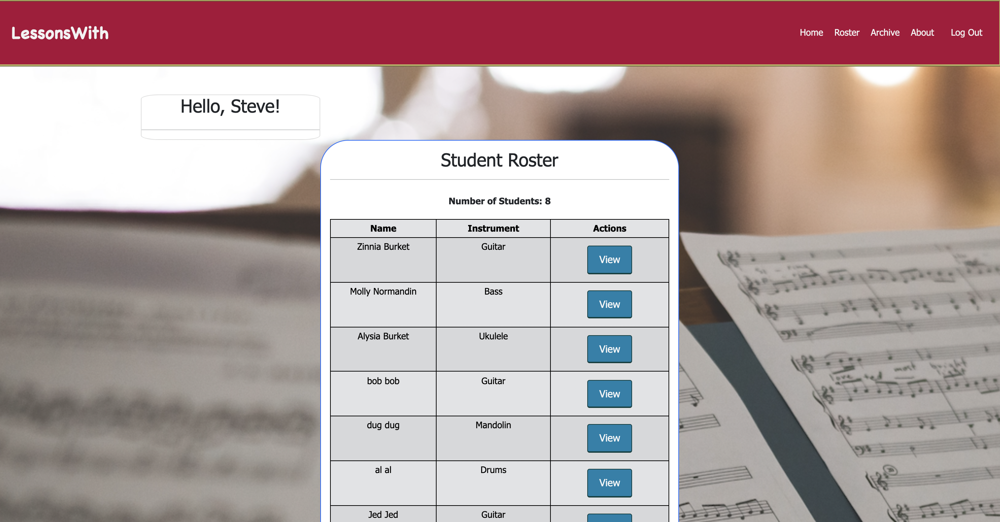

# LessonsWith

## Description

_Duration: 2 Week Sprint_

Having 10+ years as a music instructor I've used a lot of different tools to help in the lesson room to help student's achieve their goals. From online TAB sites, to YouTube/ Spotify, and platforms such as Take Lessons I've found the benefit of tech in the lesson room and to help find students. Out of all the tools I've used there is an easy way for the teacher to communicate information to the student but not as easy for the student to communicate back. There have been Practice Log features but are never used by the student as it's not always a highlight of the App. Through LessonsWith, my goal was to make an App that puts the Practice Log front and center as way for student's to keep track of progress and for the teacher to see what the student has practiced over the week and answer questions when they arise or give tips on how to practice to get better results.

## Screen Shot

Teacher's Home view
---

Teacher's overall view of submitted practice logs
---

Student's Home view
---

---

Student's Detailed view of logs
---
   
---

Student's Edit Log view
---

---

### Prerequisites

Link to software that is required to install the app (e.g. node).

- [Node.js](https://nodejs.org/en/)

## Installation

If your application has secret keys (for example --  Twilio), make sure you tell them how to set that up, both in getting the key and then what to call it in the `.env` file.

1. Create a database named `lessons-with`,
2. The queries in the `database.sql` file are set up to create all the necessary tables and populate the needed data to allow the application to run correctly. The project is built on [Postgres](https://www.postgresql.org/download/), so you will need to make sure to have that installed. We recommend using Postico to run those queries as that was used to create the queries, 
3. Open up your editor of choice and run an `npm install`
4. Run `npm run server` in your terminal
5. Run `npm run client` in your terminal
6. The `npm run client` command will open up a new browser tab for you!

## Testing Routes with Postman

To use Postman with this repo, you will need to set up requests in Postman to register a user and login a user at a minimum.

Keep in mind that once you using the login route, Postman will manage your session cookie for you just like a browser, ensuring it is sent with each subsequent request. If you delete the `localhost` cookie in Postman, it will effectively log you out.

1. Start the server - `npm run server`
2. Import the sample routes JSON file [v2](./PostmanPrimeSoloRoutesv2.json) by clicking `Import` in Postman. Select the file.
3. Click `Collections` and `Send` the following three calls in order:
   1. `POST /api/user/register` registers a new user, see body to change username/password
   2. `POST /api/user/login` will login a user, see body to change username/password
   3. `GET /api/user` will get user information, by default it's not very much

After running the login route above, you can try any other route you've created that requires a logged in user!

## Usage
How does someone use this application? Tell a user story here.

1. Teacher has ability to view Student Roster
2. Teacher can select a student to get a table archive of that student's logs
3. Student can submit practice logs for their own archive as well as for the teacher to see
4. Student can edit and delete logs when needed.

## Built With

- Create React App
- Express
- React Bootstrap
- Redux
- Axios
- Passport
- PostgresSQL

(a full list of dependencies can be found in `package.json`).

## Production Build

Before pushing to Heroku, run `npm run build` in terminal. This will create a build folder that contains the code Heroku will be pointed at. You can test this build by typing `npm start`. Keep in mind that `npm start` will let you preview the production build but will **not** auto update.

- Start postgres if not running already by using `brew services start postgresql`
- Run `npm start`
- Navigate to `localhost:5000`

## Deployment

1. Create a new Heroku project
1. Link the Heroku project to the project GitHub Repo
1. Create an Heroku Postgres database
1. Connect to the Heroku Postgres database from Postico
1. Create the necessary tables
1. Add an environment variable for `SERVER_SESSION_SECRET` with a nice random string for security
1. In the deploy section, select manual deploy

## Acknowledgement
Thanks to [Emerging Digital Academy](https://www.emergingacademy.org/) who equipped and helped me to make this application a reality. 

Thank you to my cohort-mates for support.

Thank you to my family for encouraging me to pursue my dreams of creating through coding.

## Support
If you have suggestions or issues, please email me at [burketsteve@gmail.com](www.google.com)

----------------------------------------------------------------------------------------------------------------------------
